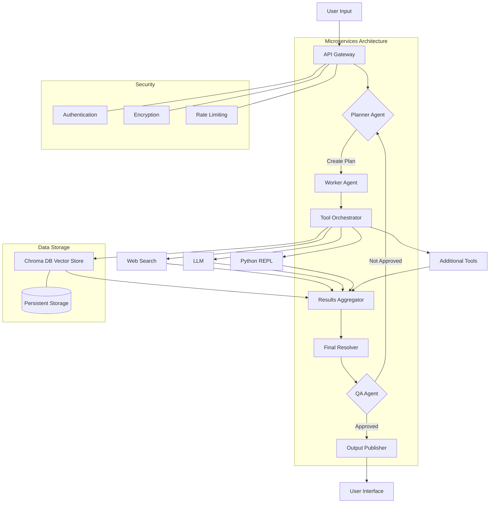

# Diagram Agent

## Overview

Mermaid Agent is a powerful tool that combines the capabilities of workflow diagramming and questionnaire generation using AI. It leverages the Mermaid markdown-like syntax to create various types of diagrams and uses advanced language models to generate relevant questionnaires.

## Features

- **Diagram Generation**: Create various types of diagrams including flowcharts, sequence diagrams, Gantt charts, ER diagrams, class diagrams, and pie charts using natural language descriptions.
- **Questionnaire Generation**: Generate comprehensive questionnaires on any given topic using AI.
- **Interactive Q&A**: Provides interactive Q&A capabilities based on expert prompts and agent responses.
- **Customizable Output**: Enables the creation of customized output files for user reference.
- **Docker Support**: Easily deployable using Docker for consistent environments across different systems.

## Installation

### Prerequisites

- Docker
- Docker Compose

### Setup

1. Clone the repository:
   ```
   git clone https://github.com/your-repo/mermaid-agent.git
   cd mermaid-agent
   ```

2. Create a `.env` file in the root directory based on the `sample_env.txt` file:
   ```
   cp sample_env.txt .env
   ```

3. Open the `.env` file and fill in the required values:
   ```
   # API Keys
   ANTHROPIC_API_KEY="your_anthropic_api_key"
   OPENAI_API_KEY="your_openai_api_key"

   # Flask Configuration
   FLASK_APP=app.py
   FLASK_ENV=development
   FLASK_DEBUG=1

   # Application Configuration
   LOG_LEVEL=INFO
   MAX_TOKENS=1000
   TEMPERATURE=0.7

   # Output Configuration
   OUTPUT_DIRECTORY="./outputs"

   # Security Configuration
   SECRET_KEY="your_secret_key"
   ```

   Make sure to replace the placeholder values with your actual API keys and configuration settings.

4. Build and run the Docker container:
   ```
   docker-compose up --build
   ```

The application will be available at `http://localhost:5000`.

## Usage

### Generating Diagrams [Slightly outdated and need updating]

To generate a diagram, send a POST request to `/generate_diagram` with the following JSON payload:

```json
{
  "description": "Your diagram description here",
  "diagram_type": "flowchart"
}
```

### Generating Questionnaires

To generate a questionnaire, send a POST request to `/generate_questionnaire` with the following JSON payload:

```json
{
  "topic": "Your questionnaire topic here"
}
```

## API Endpoints

- `GET /`: Welcome message
- `POST /generate_diagram`: Generate a diagram based on the provided description and type
- `POST /generate_questionnaire`: Generate a questionnaire based on the provided topic

## Development

To run the application locally for development:

1. Install the required packages:
   ```
   pip install -r requirements.txt
   ```

2. Set up your environment variables by copying the `sample_env.txt` to `.env` and filling in the required values as described in the Setup section.

3. Run the Flask application:
   ```
   flask run
   ```

## Example Output

Here's an example of the output you might get when using the Mermaid Agent to create a flowchart for an AI chatbot system:



This diagram illustrates the process and components of an advanced AI chatbot system using LangChain, incorporating microservices best practices.

## Dependencies

The Mermaid Agent relies on several key libraries and frameworks. Here's a breakdown of the main dependencies:

1. **LangChain**: Used for building applications with large language models (LLMs).
2. **OpenAI**: Provides access to OpenAI's language models.
3. **Anthropic**: Used for accessing Anthropic's language models.
4. **Flask**: Web framework for creating the API.
5. **Pydantic**: Data validation and settings management using Python type annotations.
6. **Python-dotenv**: Reads key-value pairs from a .env file and sets them as environment variables.
7. **Requests**: HTTP library for making API calls.
8. **Pillow**: Python Imaging Library for image processing tasks.
9. **NumPy**: Library for numerical computing in Python.
10. **PyYAML**: YAML parser and emitter for Python.
11. **Mermaid**: Library for generating diagrams and flowcharts.

These dependencies and their specific versions are listed in the `requirements.txt` file. You can install all required packages by running:

```
pip install -r requirements.txt
```

## Contributing

Contributions are welcome! Please feel free to submit a Pull Request.

### Future developments
- Anthropic Prompt caching support (massively reduces the token costs)
- More LLM provider support 
- Federated inference capabilities 
- Ollama support for local inference 
- PDF/ CSV upload support during the initial interview questionnaire to provide context from existing documents
- C4 diagram generation support 

## License

This project is licensed under the MIT License. See the [LICENSE](LICENSE) file for details.