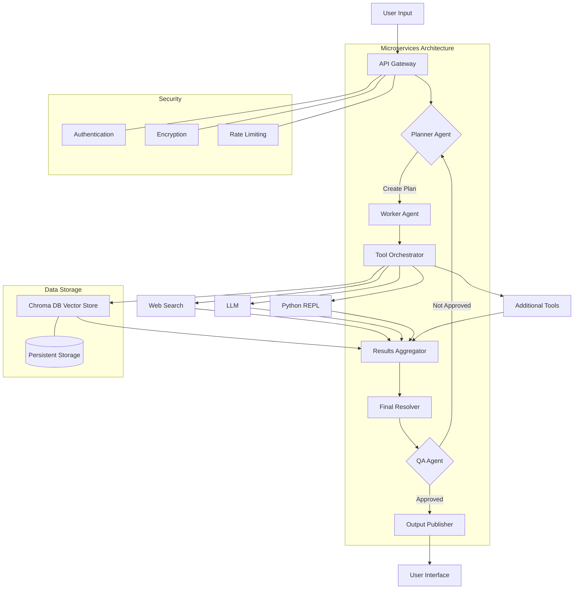

# Diagram Agent

## Table of Contents

- [Diagram Agent](#diagram-agent)
  - [Table of Contents](#table-of-contents)
  - [Overview](#overview)
  - [Features](#features)
  - [Diagrams Users Can Generate](#diagrams-users-can-generate)
  - [User Experience Flow](#user-experience-flow)
  - [Front End Features](#front-end-features)
  - [Setup and Run Guidance](#setup-and-run-guidance)
    - [Prerequisites](#prerequisites)
    - [Docker Version](#docker-version)
    - [Non-Docker Version](#non-docker-version)
  - [Usage](#usage)
    - [Generating Diagrams](#generating-diagrams)
    - [Generating Questionnaires](#generating-questionnaires)
  - [API Endpoints](#api-endpoints)
  - [Example Output](#example-output)
  - [Dependencies](#dependencies)
  - [Contributing](#contributing)
  - [Future Developments](#future-developments)
  - [License](#license)

## Overview

Mermaid Agent is a powerful tool that combines the capabilities of workflow diagramming and questionnaire generation using AI. It leverages the Mermaid markdown-like syntax to create various types of diagrams and uses advanced language models to generate relevant questionnaires.

## Features

- **Natural Language Processing**: Diagram Agent uses advanced language models to generate relevant questionnaires.
- **Diagram Generation**: Create various types of diagrams such as flowcharts, sequence diagrams, Gantt charts, ER diagrams, class diagrams, and pie charts using natural language descriptions.
- **Docker Support**: Easily deployable using Docker for consistent environments across different systems.
- **Modular Design**: Extensible to support additional diagram types.

## Diagrams Users Can Generate

- Flowcharts
- Sequence Diagrams
- Gantt Charts
- ER Diagrams
- Class Diagrams
- Pie Charts
- Mindmaps

## User Experience Flow

1. **Welcome Message**: Users are greeted with a welcome message and instructions.
2. **Interactive Questionnaire**: Users answer questions to specify the diagram details.
3. **Diagram Generation**: The agent generates the requested diagram based on user input.
4. **Review and Modify**: Users can request modifications if necessary.
5. **Final Output**: The final Mermaid code is provided, ready for use in any Mermaid renderer.

## Front End Features

- **Interactive Console**: Real-time interaction via console interface.
- **WebSocket Integration**: Real-time updates and communication between front end and back end.
- **Responsive Design**: Accessible on various devices.

## Setup and Run Guidance

### Prerequisites

- Docker
- Docker Compose

### Docker Version

1. **Clone the repository**:
   ```sh
   git clone https://github.com/your-repo/mermaid-agent.git
   cd mermaid-agent
   ```

2. **Create a `.env` file**:
   ```sh
   cp sample_env.txt .env
   ```

3. **Open the `.env` file and fill in the required values**:
   ```env
   ANTHROPIC_API_KEY="your_anthropic_api_key"
   OPENAI_API_KEY="your_openai_api_key"
   FLASK_APP=app.py
   FLASK_ENV=development
   FLASK_DEBUG=1
   LOG_LEVEL=INFO
   MAX_TOKENS=1000
   TEMPERATURE=0.7
   OUTPUT_DIRECTORY="./outputs"
   SECRET_KEY="your_secret_key"
   ```

4. **Build and run the Docker container**:
   ```sh
   docker-compose up --build
   ```

### Non-Docker Version

1. **Clone the repository**:
   ```sh
   git clone https://github.com/your-repo/mermaid-agent.git
   cd mermaid-agent
   ```

2. **Create a virtual environment and activate it**:
   ```sh
   python3 -m venv env
   source env/bin/activate
   ```

3. **Install the required packages**:
   ```sh
   pip install -r requirements.txt
   ```

4. **Create a `.env` file**:
   ```sh
   cp sample_env.txt .env
   ```

5. **Open the `.env` file and fill in the required values**:
   ```env
   ANTHROPIC_API_KEY="your_anthropic_api_key"
   OPENAI_API_KEY="your_openai_api_key"
   FLASK_APP=app.py
   FLASK_ENV=development
   FLASK_DEBUG=1
   LOG_LEVEL=INFO
   MAX_TOKENS=1000
   TEMPERATURE=0.7
   OUTPUT_DIRECTORY="./outputs"
   SECRET_KEY="your_secret_key"
   ```

6. **Run the Flask application**:
   ```sh
   flask run
   ```

Access the application at `http://localhost:5000`.

## Usage

### Generating Diagrams

Send a POST request to `/generate_diagram` with the following JSON payload:

```json
{
  "description": "Your diagram description here",
  "diagram_type": "flowchart"
}
```

### Generating Questionnaires

Send a POST request to `/generate_questionnaire` with the following JSON payload:

```json
{
  "topic": "Your questionnaire topic here"
}
```

## API Endpoints

- `GET /`: Welcome message
- `POST /generate_diagram`: Generate a diagram based on the provided description and type
- `POST /generate_questionnaire`: Generate a questionnaire based on the provided topic

## Example Output

Using Diagram Agent to create a flowchart for an AI chatbot system:



## Dependencies

Diagram Agent relies on several key libraries and frameworks:

Install required packages by running:

```sh
pip install -r requirements.txt
```

## Contributing

Contributions are welcome! Please submit a Pull Request.

## Future Developments

- Anthropic Prompt caching support (massively reduces the token costs)
- More LLM provider support
- Federated inference capabilities
- Ollama support for local inference
- PDF/CSV upload support during the initial interview questionnaire to provide context from existing documents
- C4 diagram generation support

## License

This project is licensed under the MIT License. See the [LICENSE](LICENSE) file for details.