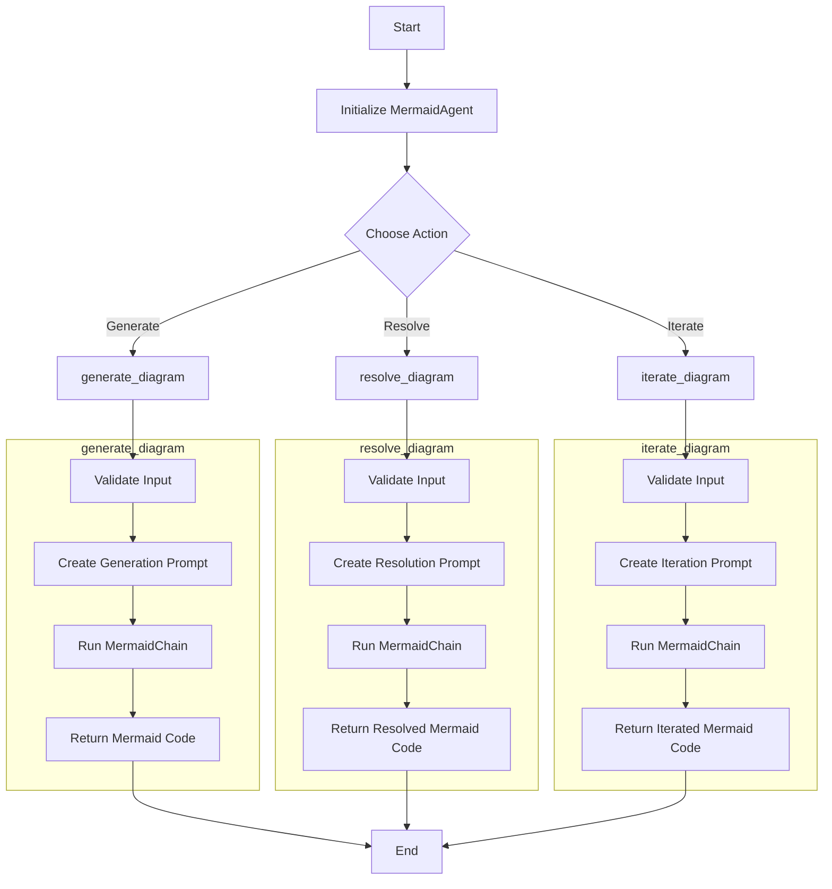

# MermaidAgent Workflow

## Workflow Description

1. **Start**: The process begins when the MermaidAgent is used.

2. **Initialize MermaidAgent**: The MermaidAgent is initialized with necessary handlers and chains.

3. **Choose Action**: The user chooses one of three main actions: Generate, Resolve, or Iterate.

4. **generate_diagram**:
   - Validates input (brief and diagram_type)
   - Creates a generation prompt using _create_generation_prompt
   - Runs the MermaidChain with the generated prompt
   - Returns the generated Mermaid code

5. **resolve_diagram**:
   - Validates input (error, damaged_mermaid_chart, brief, and diagram_type)
   - Creates a resolution prompt using _create_resolution_prompt
   - Runs the MermaidChain with the generated prompt
   - Returns the resolved Mermaid code

6. **iterate_diagram**:
   - Validates input (change_request, brief, diagram_type, and current_mermaid_chart)
   - Creates an iteration prompt using _create_iteration_prompt
   - Runs the MermaidChain with the generated prompt
   - Returns the iterated Mermaid code

7. **End**: The process ends with the return of the appropriate Mermaid code based on the chosen action.

## Function Descriptions

- **generate_diagram**: This function takes a brief description and diagram type as input. It creates a prompt for generating a new Mermaid diagram, runs it through the MermaidChain, and returns the generated Mermaid code.

- **resolve_diagram**: This function is used when there's an error in an existing diagram. It takes the error message, the damaged Mermaid chart, the original brief, and the diagram type as input. It creates a prompt for resolving the issues, runs it through the MermaidChain, and returns the corrected Mermaid code.

- **iterate_diagram**: This function is used to make changes to an existing diagram. It takes a change request, the original brief, the diagram type, and the current Mermaid chart as input. It creates a prompt for implementing the requested changes, runs it through the MermaidChain, and returns the updated Mermaid code.

Each of these main functions follows a similar pattern:
1. Validate the input
2. Create an appropriate prompt
3. Run the prompt through the MermaidChain
4. Return the resulting Mermaid code

The MermaidChain is a key component that interacts with the LLM (Language Model) to generate, resolve, or iterate on Mermaid diagrams based on the provided prompts.