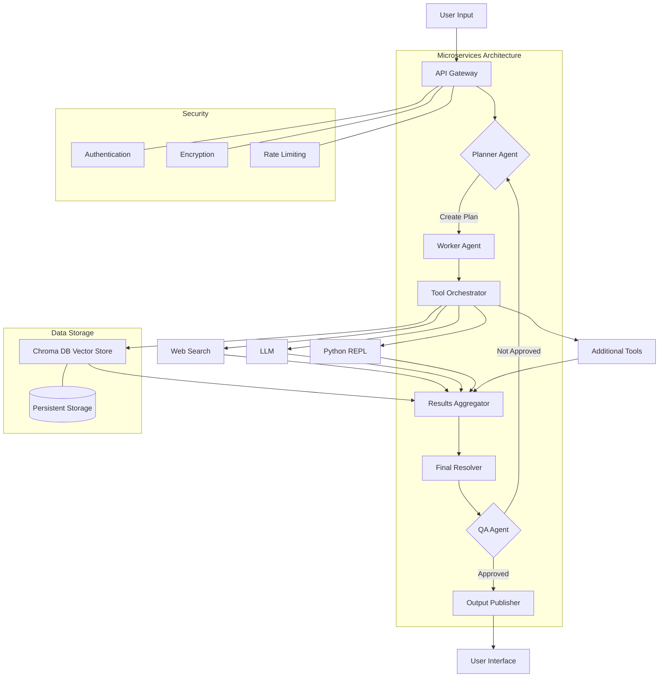

============================================================================================================================================================================================
                                                                       👋  Welcome to the Mermaid Diagram Generator  👋                                                                       
============================================================================================================================================================================================

This interactive tool will guide you through creating a Mermaid diagram.
Please follow these steps:
1. Answer the questions about your diagram
2. Review the generated Mermaid code
3. Use the code in your preferred Mermaid renderer

ℹ️  Hey there! What kind of diagram are you looking to create? Feel free to share any specific requirements or ideas you have in mind – I'm here to help!
➤ Your answer: i want to create a flowchart on the process of developing an AI chatbot using langchain
ℹ️  Can you outline the main steps involved in developing an AI chatbot using LangChain? This will help us determine the key elements to include in the flowchart.
➤ Your answer: the user enters the question, the ai then provide the answer. if neeed be it will use  web search to find the correct answer. this is jst a basic version. improve it sing your knowledge and best practice
ℹ️  What are the main components and processes involved in an AI-powered question-answering system, and how do they interact with each other?
➤ Your answer: have a planner agent, a worker agent that does the tool calling. web search, llm, python repl, chroma db vector store retrival are the tools. see if yo can come up with a a few more tools. the tool otpts and the original query and the plan goes to the final resolver who will generate the output, show it to a QA agent and if the QA agent approves, it get published, if not, it loops back to the planner. try to add best parctices of a microservices system into this flow and impvrove it

============================================================================================================================================================================================
                                                                                 🎉  Diagramming Results  🎉                                                                                  
============================================================================================================================================================================================

--------------------------------------------------------------------------------------------------------------------------------------------------------------------------------------------
                                                                                 📝  Expert Brief Summary  📝                                                                                 
--------------------------------------------------------------------------------------------------------------------------------------------------------------------------------------------

Summary for AI Chatbot System Architecture Diagram:

Purpose: Illustrate the process and components of an advanced AI chatbot system using LangChain, incorporating microservices best practices.

Key Elements:
1. User Input
2. Planner Agent
3. Worker Agent
4. Tools: Web Search, LLM, Python REPL, Chroma DB Vector Store Retrieval (and additional tools)
5. Final Resolver
6. QA Agent
7. Output Publication

Relationships:
- User input initiates the process
- Planner Agent creates a plan based on the query
- Worker Agent executes the plan using various tools
- Final Resolver generates output based on tool results, original query, and plan
- QA Agent reviews the output
- Feedback loop from QA Agent to Planner if output is not approved

Notations:
- Use directional arrows to show data flow
- Distinguish between agents, tools, and processes using different shapes or colors
- Include decision points (e.g., QA approval)

Level of Detail:
- Medium to high, showing main components and their interactions
- Include brief descriptions of each component's function

Target Audience:
- Developers and architects familiar with AI systems and microservices

Additional Considerations:
- Incorporate microservices architecture principles
- Show scalability and fault tolerance aspects
- Include data storage and retrieval mechanisms
- Highlight security measures and API gateways

This summary provides a comprehensive overview for creating a detailed system architecture diagram of an advanced AI chatbot using LangChain and microservices best practices.

--------------------------------------------------------------------------------------------------------------------------------------------------------------------------------------------
                                                                                💻  Generated Mermaid Code  💻                                                                                
--------------------------------------------------------------------------------------------------------------------------------------------------------------------------------------------

============================================================================================================================================================================================
                                                                             🎈  Diagram Generation Complete  🎈                                                                              
============================================================================================================================================================================================

🌟 Your Mermaid diagram has been successfully generated! 🌟
Next steps:
1. Copy the generated Mermaid code
2. Paste it into your preferred Mermaid renderer
3. Visualize and enjoy your diagram!