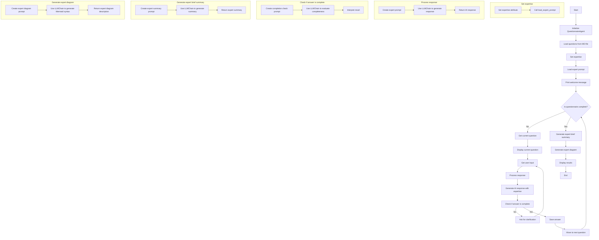
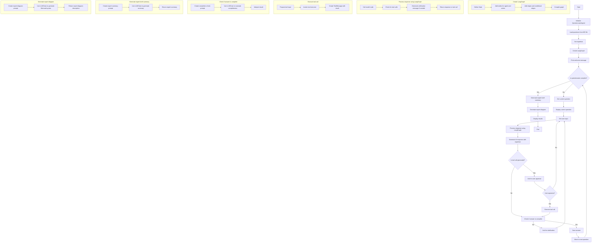

# v1

```mermaid
graph TD
    A[Start] --> B[Initialize QuestionnaireAgent]
    B --> C[Load questions from MD file]
    C --> D[Set expertise]
    D --> E[Load expert prompt]
    E --> F[Print welcome message]
    F --> G{Is questionnaire complete?}
    
    G -->|No| H[Get current question]
    H --> I[Display current question]
    I --> J[Get user input]
    J --> K[Process response]
    
    K --> L[Generate AI response with expertise]
    L --> M[Check if answer is complete]
    M -->|No| N[Ask for clarification]
    N --> J
    M -->|Yes| O[Save answer]
    O --> P[Move to next question]
    P --> G
    
    G -->|Yes| Q[Generate expert brief summary]
    Q --> R[Generate expert diagram]
    R --> S[Display results]
    S --> T[End]
    
    subgraph "Set expertise"
    D1[Set expertise attribute] --> D2[Call load_expert_prompt]
    end
    
    subgraph "Process response"
    K1[Create expert prompt] --> K2[Use LLMChain to generate response]
    K2 --> K3[Return AI response]
    end
    
    subgraph "Check if answer is complete"
    M1[Create completion check prompt] --> M2[Use LLMChain to evaluate completeness]
    M2 --> M3[Interpret result]
    end
    
    subgraph "Generate expert brief summary"
    Q1[Create expert summary prompt] --> Q2[Use LLMChain to generate summary]
    Q2 --> Q3[Return expert summary]
    end
    
    subgraph "Generate expert diagram"
    R1[Create expert diagram prompt] --> R2[Use LLMChain to generate Mermaid syntax]
    R2 --> R3[Return expert diagram description]
    end
```

# v2 - New and Improved Workflow

```mermaid
graph TD
    A[Start] --> B[Initialize QuestionnaireAgent]
    B --> C[Load questions from MD file]
    C --> D[Set expertise]
    D --> E[Create LangGraph]
    E --> F[Print welcome message]
    F --> G{Is questionnaire complete?}

    G -->|No| H[Get current question]
    H --> I[Display current question]
    I --> J[Get user input]
    J --> K[Process response using LangGraph]
    
    K --> L[Generate AI response with expertise]
    L --> M{Is tool call generated?}
    M -->|Yes| N[Ask for user approval]
    N --> O{User approves?}
    O -->|Yes| P[Execute tool call]
    O -->|No| J
    M -->|No| Q[Check if answer is complete]
    P --> Q
    Q -->|No| R[Ask for clarification]
    R --> J
    Q -->|Yes| S[Save answer]
    S --> T[Move to next question]
    T --> G
    
    G -->|Yes| U[Generate expert brief summary]
    U --> V[Generate expert diagram]
    V --> W[Display results]
    W --> X[End]
    
    subgraph "Create LangGraph"
    E1[Define State] --> E2[Add nodes for agent and action]
    E2 --> E3[Add edges and conditional edges]
    E3 --> E4[Compile graph]
    end
    
    subgraph "Process response using LangGraph"
    K1[Call model node] --> K2[Check for tool calls]
    K2 --> K3[Generate verification message if needed]
    K3 --> K4[Return response or tool call]
    end
    
    subgraph "Execute tool call"
    P1[Prepare tool input] --> P2[Invoke tool executor]
    P2 --> P3[Create ToolMessage with result]
    end
    
    subgraph "Check if answer is complete"
    Q1[Create completion check prompt] --> Q2[Use LLMChain to evaluate completeness]
    Q2 --> Q3[Interpret result]
    end
    
    subgraph "Generate expert brief summary"
    U1[Create expert summary prompt] --> U2[Use LLMChain to generate summary]
    U2 --> U3[Return expert summary]
    end
    
    subgraph "Generate expert diagram"
    V1[Create expert diagram prompt] --> V2[Use LLMChain to generate Mermaid syntax]
    V2 --> V3[Return expert diagram description]
    end
```